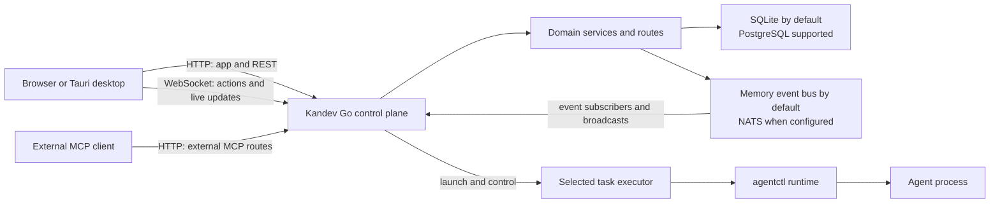

# Kandev Architecture

This document summarizes the current runtime. For the detailed architecture, protocol,
and trust-boundary reference, see [Architecture](public/architecture.md).

## Runtime shape

The Kandev control plane is one Go process. The native `kandev` executable starts
the Go launcher; its internal `__backend` command starts the backend composition
root. The control plane serves the web application, HTTP API, WebSocket API, health
endpoints, and external MCP routes.

The browser and Tauri desktop shell connect to the control plane. Task agents run
through the selected executor and its `agentctl` runtime. Depending on the executor,
that runtime may run on the same host, in a container, or on a remote host.

Route registration, domain services, and orchestration responsibilities are
composed inside the Go process.

## HTTP, REST, and WebSocket

The backend registers HTTP endpoints for domain operations and serves the compiled
single-page application from the same server.

The shared application WebSocket endpoint is `/ws`. It carries action messages
and live notifications. Dedicated WebSocket routes also handle terminal, LSP, and
other task-runtime connections. The web client uses both transports: HTTP
endpoints expose domain operations, while WebSocket carries selected actions and
live updates.

Agent communication has another boundary. The backend lifecycle manager controls
agentctl through the selected executor. Agentctl owns the agent subprocess and
adapts its supported protocol, including ACP. The browser communicates with the
backend over HTTP and WebSocket.

## Persistence and events

SQLite is the default database. PostgreSQL is also supported through the database
configuration. The persistence package opens the database before repository setup;
domain repositories and stores initialize their schemas and apply their upgrades.

The event bus is separate from durable storage. With no NATS URL configured,
Kandev uses an in-memory bus. A configured NATS URL selects NATS. Events provide
live internal fan-out; consumers recover durable state from the database because
the bus does not provide event replay.

## Launch and web assets

All launch modes use the native Go launcher in
`apps/backend/internal/launcher/`:

- `dev` runs the backend from the repository and supervises the Vite development
  server. The browser still connects to Go, which proxies web requests to Vite.
- `start` runs the local production build.
- `run` starts the installed runtime bundle.
- `service` installs or manages an operating-system service.

Release builds embed the compiled web assets in the Go binary. The published npm
package is a small shim that selects a native runtime package and starts its
binary. The Tauri desktop shell starts the native backend in headless mode and
displays its web UI in a native window.

## Deployment and task execution

The control plane can run as a native runtime or from the published
[Docker image](public/docker.md). The image contains the control-plane binary
and host-side `agentctl`. The Local Docker executor creates separate containers
for task agents.

The repository also provides an experimental [Kubernetes deployment example](public/k8s.md).
It runs one persistent control-plane replica and does not provide a
high-availability topology. The Kubernetes executor is a separate, opt-in way
to run task agents as Pods. Workspaces, process connections, and runtime state
remain local to the control-plane replica, so PostgreSQL or NATS alone do not
establish a supported multi-replica topology.

Executor profiles determine where task environments run. Current options include
local and worktree environments, Docker, remote Docker, Sprites, SSH, Kubernetes,
and installed remote executor providers. The control plane can therefore be
separate from the machine or cluster that runs a task agent.

See [Executors](public/executors.md) for executor behavior and setup. Deployment
instructions belong to the [Docker](public/docker.md) and
[Kubernetes](public/k8s.md) guides.

## Credential boundary

Credentials explicitly delivered to an executor are available to its agent
processes. For GitHub, Kandev-managed task Git access uses repository-scoped
leases through agentctl. For GitLab, tasks receive the active workspace token;
SSH remotes require credentials configured in the executor. Provider operations
use the workspace's integration connection. GitHub App installation tokens are
minted for one repository. PAT and named CLI tokens retain their provider-granted
scope after redemption, so the agent process is trusted with that grant. App
registration private keys and personal OAuth tokens stay in the backend.

GitHub App registrations are stored in a deployment catalog. Each workspace
that uses App automation selects a registration and a verified installation; a
registration alone is not a global active connection. See:

- [Managed GitHub credentials](public/executors.md#managed-github-credentials)
- [GitHub integrations](public/integrations.md#github)
- [GitHub authentication ownership](decisions/0047-github-authentication-ownership.md)

## Code ownership

- `apps/backend/internal/backendapp/` composes services and registers HTTP and
  WebSocket routes.
- `internal/task/`, `internal/workflow/`, `internal/orchestrator/`, `internal/runs/`,
  and `internal/office/` own their domain behavior and coordination.
- `internal/agent/runtime/` and `internal/agent/runtime/lifecycle/` coordinate
  agent launches and executor lifecycles.
- `internal/agentctl/` serves the task runtime API and manages agent processes.
- `internal/persistence/`, `internal/db/`, and domain repositories or stores own
  database setup and persisted state.
- `apps/web/lib/api/` and `apps/web/lib/ws/` implement the browser's HTTP API and
  WebSocket clients.
